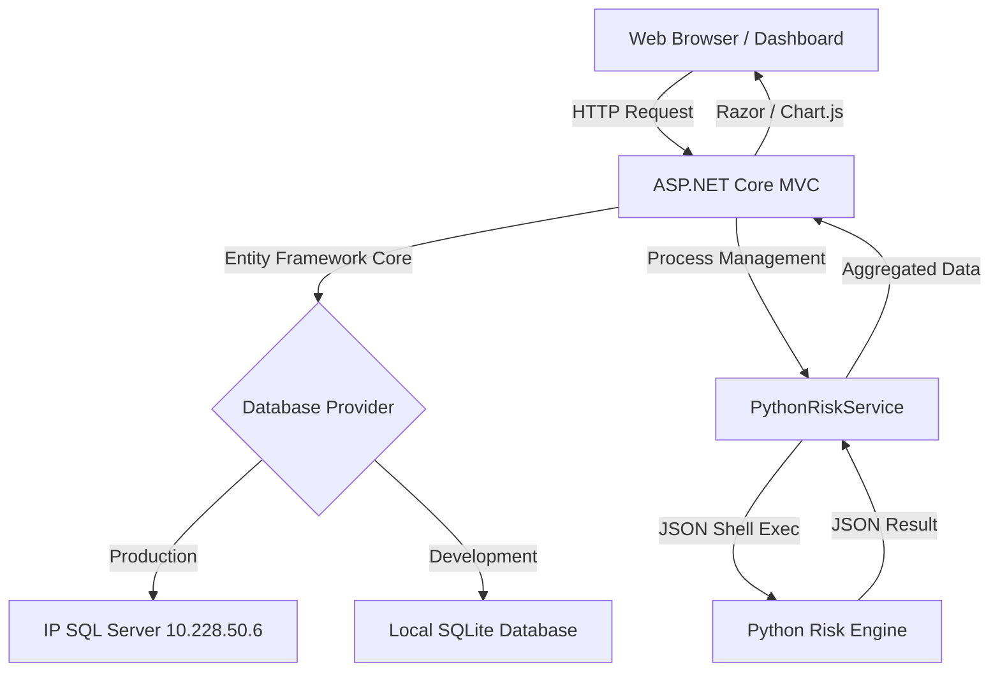

# TradeNexus: Enterprise B2B Brokerage Infrastructure
## Project Vision & Technical Deep Dive

TradeNexus is a high-performance **Multi-Tenant B2B Brokerage Infrastructure Management System**. It is designed to bridge the gap between traditional trade logging and modern, AI-augmented risk analysis. This document provides an exhaustive breakdown of why we built it, how it works, and the sophisticated engineering behind its C#-Python interop.

---

## 1. The "Why": Problem & Purpose
In the world of high-frequency trading and B2B brokerage, managing thousands of clients across different sub-brokers is a massive data challenge. Traditional systems are often either:
- **Too Heavy**: Requiring massive SQL Server clusters for simple local testing.
- **Too Dumb**: Only storing trades without providing real-time risk intelligence.

**TradeNexus was built to solve this.** We created a system that is:
1. **Portable**: Runs anywhere (Local SQLite or Remote SQL Server).
2. **Intelligent**: Automatically calculates risk using an external Python AI engine.
3. **Institutional Grade**: Follows an "Inventory Intelligence" design aesthetic used by top-tier financial platforms.

---

## 2. Technical Architecture
TradeNexus is built on a modular **N-Tier Architecture**:



---

## 3. The "How": Technical Stack
### Backend (The Brain)
- **C# / .NET 10.0**: The backbone of the application, handling routing, data access, and security.
- **Entity Framework Core**: A powerful ORM that allows us to switch between databases without changing a single line of business logic.
- **Dependency Injection**: Services like `PythonRiskService` are registered globally for clean, testable code.

### Risk Engine (The Math)
- **Python 3.12**: Used for its superior mathematical and statistical libraries (NumPy/Pandas/Scipy) which are the industry standard for risk calculation.

### Frontend (The Face)
- **Bootstrap 5 + Vanilla CSS**: Custom-tuned for the **Inventory Intelligence** aesthetic (Light grey body, Dark navy navbar).
- **Chart.js**: Real-time rendering of trade exposure and risk donuts.
- **Poppins & Inter Fonts**: Institutional typography for maximum readability.

---

## 4. The Dual-Database Engine
One of TradeNexus's most powerful features is its **Database Parity**.

- **SQLite (Local.db)**: Lightweight and file-based. Perfect for high-speed development or when you're disconnected from the main server. The system **automatically seeds** this with sample clients if it's empty.
- **SQL Server (Remote IP)**: The "Powerhouse". Used for production data across multiple tenants.

**How we switch?**
We use the `ASPNETCORE_ENVIRONMENT` flag.
- **Development** → `appsettings.Development.json` (SQLite)
- **Production** → `appsettings.json` (Remote IP)

---

## 5. The Workflow: A Life Cycle of a Trade
How does a click on the dashboard result in a risk assessment?

1. **Request**: The user clicks "Risk AI" on a client row.
2. **Data Aggregation**: `TradeController` retrieves all trade history for that `ClientId` from the database.
3. **JSON Serialization**: C# converts the database models into a compact JSON string.
4. **The Python Bridge**:
   - `PythonRiskService` starts a new hidden OS process.
   - It calls `python.exe` and passes the Trade JSON as a command-line argument.
   - The Python script (`risk_engine.py`) parses the JSON, calculates volatility, and generates a Risk Score.
5. **The Return**: Python prints the result to the console (Standard Output). C# captures this output into a string.
6. **Visualization**: The resulting JSON is passed to the `RiskResult.cshtml` view, which renders the color-coded outcome for the user.

---

## 6. Deep Dive: C# Calling Python
This is the core "Magic" of the project. We don't use slow APIs or complex sockets; we use a **High-Speed Shell Interop**.

**C# Implementation (`PythonRiskService.cs`):**
```csharp
ProcessStartInfo start = new ProcessStartInfo
{
    FileName = "python",
    Arguments = $"{scriptPath} {jsonInput}",
    RedirectStandardOutput = true,
    CreateNoWindow = true
};
using (Process process = Process.Start(start))
{
    string result = process.StandardOutput.ReadToEnd();
}
```

**Why this way?**
- **Isolation**: If the Python engine crashes, the C# website stays up. 
- **Security**: The Python script only has access to the data we explicitly send it.
- **Performance**: No network overhead; it's a direct memory-to-memory transfer.

---

## 7. UI/UX: The Inventory Intelligence Standard
We've moved away from generic "Dark Mode" into a **Premium Light Aesthetic**.
- **The Navbar**: Sticky dark navy gradient (`#0f172a` to `#1a2744`) providing a permanent "Command Center" feel.
- **The Cards**: White panels with 4px soft shadows. Large numeric values facilitate rapid data scanning.
- **The Micro-Animations**:
    - **KPI Count-up**: Numbers roll up when you land on the page.
    - **Utilization Fill**: Progress bars slide into place to show margin usage.
    - **Filter Tabs**: Instant filtering of hundreds of clients without a page reload.

---

## 8. Summary of Achievements
- [x] **Full Stack Interop**: Successfully bridged .NET 10 with Python AI.
- [x] **Dynamic UI**: Implemented a state-of-the-art brokerage dashboard.
- [x] **Dual DB Architecture**: Built-in support for local and remote data.
- [x] **Automated Data Seeding**: Fully functional demo environment created from scratch.

TradeNexus isn't just a website; it's a **B2B Infrastructure Blueprint**.
